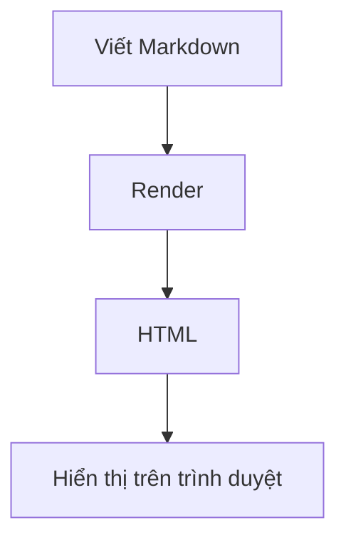

# Tìm hiểu Markdown

## Mục lục

- [1. Tổng quan](#1-tổng-quan)
- [2. Markdown dùng để làm gì?](#2-markdown-dùng-để-làm-gì)
- [3. Ưu điểm và hạn chế](#3-ưu-điểm-và-hạn-chế)
- [4. Các phiên bản Markdown thường gặp](#4-các-phiên-bản-markdown-thường-gặp)
- [5. Cấu trúc cơ bản của file Markdown](#5-cấu-trúc-cơ-bản-của-file-markdown)
- [6. Cú pháp Markdown cơ bản](#6-cú-pháp-markdown-cơ-bản)
- [7. Code trong Markdown](#7-code-trong-markdown)
- [8. Liên kết và hình ảnh](#8-liên-kết-và-hình-ảnh)
- [9. Bảng trong Markdown](#9-bảng-trong-markdown)
- [10. Đường phân cách](#10-đường-phân-cách)
- [11. Escape ký tự đặc biệt](#11-escape-ký-tự-đặc-biệt)
- [12. HTML trong Markdown](#12-html-trong-markdown)
- [13. Ghi chú, cảnh báo và khối thông tin](#13-ghi-chú-cảnh-báo-và-khối-thông-tin)
- [14. Footnote](#14-footnote)
- [15. Definition list](#15-definition-list)
- [16. Mermaid diagram](#16-mermaid-diagram)
- [17. Công thức toán học](#17-công-thức-toán-học)
- [18. Front matter](#18-front-matter)
- [19. Mục lục trong Markdown](#19-mục-lục-trong-markdown)
- [20. Quy tắc viết Markdown dễ đọc](#20-quy-tắc-viết-markdown-dễ-đọc)
- [21. Markdown trong GitHub](#21-markdown-trong-github)
- [22. Markdown trong Visual Studio Code](#22-markdown-trong-visual-studio-code)
- [23. Markdown và HTML](#23-markdown-và-html)
- [24. Markdown trong PHP](#24-markdown-trong-php)
- [25. Bảo mật khi dùng Markdown](#25-bảo-mật-khi-dùng-markdown)
- [26. Lỗi thường gặp khi viết Markdown](#26-lỗi-thường-gặp-khi-viết-markdown)
- [27. Ví dụ một file README.md hoàn chỉnh](#27-ví-dụ-một-file-readmemd-hoàn-chỉnh)
- [28. Checklist học Markdown](#28-checklist-học-markdown)
- [29. Bài tập thực hành](#29-bài-tập-thực-hành)
- [30. Tóm tắt cú pháp nhanh](#30-tóm-tắt-cú-pháp-nhanh)
- [31. Kết luận](#31-kết-luận)

## 1. Tổng quan

Markdown là một ngôn ngữ đánh dấu nhẹ dùng để định dạng văn bản bằng cú pháp đơn giản, dễ đọc ngay cả khi chưa được render thành HTML. Markdown thường được dùng để viết tài liệu kỹ thuật, README, ghi chú học tập, blog, tài liệu dự án, nội dung GitHub, tài liệu API và các trang tĩnh.

Mục tiêu chính của Markdown là giúp người viết tập trung vào nội dung thay vì phải viết nhiều thẻ HTML phức tạp. Ví dụ, thay vì viết:

```html
<h1>Tiêu đề</h1>
<p>Đây là một đoạn văn bản.</p>
```

ta có thể viết Markdown như sau:

```markdown
# Tiêu đề

Đây là một đoạn văn bản.
```

Khi được xử lý bởi trình render Markdown, nội dung trên có thể được chuyển thành HTML tương ứng để hiển thị trên trình duyệt.

## 2. Markdown dùng để làm gì?

Markdown được sử dụng rộng rãi trong nhiều tình huống:

- Viết file `README.md` cho dự án phần mềm.
- Ghi chú học tập hoặc tài liệu nội bộ.
- Viết tài liệu kỹ thuật, hướng dẫn cài đặt, hướng dẫn sử dụng.
- Viết nội dung trên GitHub, GitLab, Bitbucket.
- Viết bài blog hoặc tài liệu cho static site generator như Jekyll, Hugo, Docusaurus, MkDocs.
- Soạn nội dung email, diễn đàn, issue, pull request.
- Viết tài liệu API, changelog, release note.
- Ghi lại quy trình vận hành, checklist triển khai, biên bản họp.

## 3. Ưu điểm và hạn chế

### 3.1. Ưu điểm

- Cú pháp ngắn gọn, dễ học.
- File Markdown là plain text nên nhẹ, dễ lưu trữ và dễ quản lý bằng Git.
- Đọc được cả khi chưa render.
- Dễ chuyển đổi sang HTML, PDF, DOCX hoặc các định dạng khác.
- Phù hợp cho tài liệu kỹ thuật và quy trình làm việc của lập trình viên.
- Được hỗ trợ bởi nhiều nền tảng phổ biến.
- Dễ review thay đổi vì nội dung là text thuần.

### 3.2. Hạn chế

- Không có một chuẩn duy nhất được mọi nền tảng hỗ trợ giống nhau.
- Một số tính năng như bảng, task list, footnote, Mermaid, math có thể phụ thuộc vào từng trình render.
- Không mạnh như HTML/CSS nếu cần bố cục phức tạp.
- Việc xuống dòng, khoảng trắng và danh sách lồng nhau đôi khi dễ gây nhầm lẫn cho người mới.
- Tài liệu có thể khó bảo trì nếu không có quy ước viết thống nhất.

## 4. Các phiên bản Markdown thường gặp

Markdown ban đầu do John Gruber tạo ra. Về sau, nhiều biến thể được phát triển để bổ sung thêm tính năng.

| Phiên bản | Đặc điểm |
| --- | --- |
| Original Markdown | Cú pháp cơ bản, ít tính năng mở rộng. |
| CommonMark | Nỗ lực chuẩn hóa Markdown để hành vi render nhất quán hơn. |
| GitHub Flavored Markdown | Dùng trên GitHub, hỗ trợ bảng, task list, strikethrough, autolink. |
| Markdown Extra | Bổ sung bảng, footnote, definition list và một số mở rộng khác. |
| MDX | Kết hợp Markdown với JSX, thường dùng trong tài liệu React. |

Trong thực tế, khi viết tài liệu cho GitHub hoặc dự án lập trình, GitHub Flavored Markdown là lựa chọn phổ biến nhất.

## 5. Cấu trúc cơ bản của file Markdown

Một file Markdown thường có phần mở đầu, mục lục, các phần nội dung chính và phần tham khảo.

```markdown
# Tên tài liệu

## Mục lục

- [Giới thiệu](#giới-thiệu)
- [Cài đặt](#cài-đặt)
- [Sử dụng](#sử-dụng)

## Giới thiệu

Nội dung giới thiệu.

## Cài đặt

Hướng dẫn cài đặt.

## Sử dụng

Hướng dẫn sử dụng.
```

Nên dùng đuôi file `.md` hoặc `.markdown`, trong đó `.md` là phổ biến nhất.

## 6. Cú pháp Markdown cơ bản

### 6.1. Tiêu đề

Markdown dùng dấu `#` để tạo tiêu đề. Số lượng dấu `#` tương ứng với cấp tiêu đề từ 1 đến 6.

```markdown
# Heading 1
## Heading 2
### Heading 3
#### Heading 4
##### Heading 5
###### Heading 6
```

Khi viết tài liệu, nên chỉ có một tiêu đề cấp 1 trong mỗi file để thể hiện tên tài liệu. Các phần bên dưới dùng `##`, `###`, `####` theo cấu trúc phân cấp.

### 6.2. Đoạn văn

Đoạn văn trong Markdown được viết như văn bản bình thường. Để tách thành đoạn mới, cần để trống một dòng.

```markdown
Đây là đoạn văn thứ nhất.

Đây là đoạn văn thứ hai.
```

Nếu chỉ xuống dòng một lần trong cùng một đoạn, nhiều trình render vẫn xem đó là cùng một đoạn văn.

### 6.3. Xuống dòng

Có một số cách xuống dòng:

```markdown
Dòng thứ nhất  
Dòng thứ hai
```

Cách trên dùng hai khoảng trắng ở cuối dòng. Tuy nhiên, vì hai khoảng trắng cuối dòng khó nhìn thấy, nhiều dự án ưu tiên dùng thẻ HTML:

```markdown
Dòng thứ nhất<br>
Dòng thứ hai
```

Trong tài liệu kỹ thuật, nên hạn chế ép xuống dòng thủ công trừ khi thật sự cần.

### 6.4. In đậm, in nghiêng và gạch ngang

```markdown
*In nghiêng*
_In nghiêng_

**In đậm**
__In đậm__

***Vừa đậm vừa nghiêng***

~~Gạch ngang~~
```

Kết quả:

- *In nghiêng*
- **In đậm**
- ***Vừa đậm vừa nghiêng***
- ~~Gạch ngang~~

Gạch ngang `~~text~~` là cú pháp phổ biến trong GitHub Flavored Markdown.

### 6.5. Trích dẫn

Dùng dấu `>` để tạo blockquote.

```markdown
> Đây là một đoạn trích dẫn.
```

Trích dẫn nhiều cấp:

```markdown
> Trích dẫn cấp 1
>
> > Trích dẫn cấp 2
```

Blockquote thường được dùng để nhấn mạnh ghi chú, cảnh báo, lời dẫn hoặc đoạn được trích từ nguồn khác.

### 6.6. Danh sách không thứ tự

Có thể dùng `-`, `*` hoặc `+`.

```markdown
- HTML
- CSS
- JavaScript
```

Nên chọn một kiểu duy nhất trong cùng tài liệu, thường là dấu `-` vì dễ đọc và phổ biến.

### 6.7. Danh sách có thứ tự

```markdown
1. Bước một
2. Bước hai
3. Bước ba
```

Markdown cũng cho phép viết cùng một số:

```markdown
1. Bước một
1. Bước hai
1. Bước ba
```

Khi render, trình xử lý có thể tự đánh số lại. Tuy nhiên, với tài liệu học tập, nên đánh số đúng để dễ đọc trực tiếp trong file raw.

### 6.8. Danh sách lồng nhau

Danh sách con cần được thụt vào bằng khoảng trắng.

```markdown
- Frontend
  - HTML
  - CSS
  - JavaScript
- Backend
  - PHP
  - Node.js
  - Java
```

Nên giữ mức lồng nhau vừa phải. Nếu tài liệu có quá nhiều cấp, hãy tách thành các heading nhỏ hơn.

### 6.9. Task list

Task list thường được dùng trong GitHub issue, pull request hoặc checklist tài liệu.

```markdown
- [x] Học cú pháp tiêu đề
- [x] Học danh sách
- [ ] Học bảng
- [ ] Học liên kết và hình ảnh
```

Kết quả:

- [x] Học cú pháp tiêu đề
- [x] Học danh sách
- [ ] Học bảng
- [ ] Học liên kết và hình ảnh

## 7. Code trong Markdown

### 7.1. Inline code

Dùng một cặp dấu backtick để viết code ngắn trong cùng dòng.

```markdown
Sử dụng lệnh `npm install` để cài dependency.
```

Kết quả:

Sử dụng lệnh `npm install` để cài dependency.

### 7.2. Code block

Dùng ba dấu backtick để tạo khối code.

````markdown
```javascript
const message = "Hello Markdown";
console.log(message);
```
````

Khi thêm tên ngôn ngữ sau ba dấu backtick, nhiều trình render sẽ highlight cú pháp.

Một số tên ngôn ngữ thường dùng:

- `html`
- `css`
- `javascript`
- `typescript`
- `php`
- `python`
- `java`
- `c`
- `cpp`
- `csharp`
- `json`
- `sql`
- `bash`
- `powershell`
- `markdown`

### 7.3. Code block không dùng backtick

Markdown cũng hỗ trợ code block bằng cách thụt vào 4 khoảng trắng:

```markdown
    console.log("Hello");
```

Tuy nhiên, cách dùng ba backtick rõ ràng hơn và được dùng phổ biến hơn trong tài liệu hiện đại.

### 7.4. Hiển thị dấu backtick bên trong code block

Nếu cần viết một ví dụ Markdown có chứa ba backtick, có thể bọc ngoài bằng bốn backtick.

`````markdown
````markdown
```javascript
console.log("example");
```
````
`````

## 8. Liên kết và hình ảnh

### 8.1. Liên kết cơ bản

```markdown
[Tên hiển thị](https://example.com)
```

Ví dụ:

```markdown
[GitHub](https://github.com)
```

### 8.2. Liên kết có tiêu đề

```markdown
[GitHub](https://github.com "Trang chủ GitHub")
```

Khi hover chuột, trình duyệt có thể hiển thị title.

### 8.3. URL tự động

Một số trình render tự nhận diện URL:

```markdown
https://github.com
```

GitHub Flavored Markdown cũng hỗ trợ autolink cho URL và email.

### 8.4. Liên kết nội bộ trong tài liệu

Có thể liên kết đến heading trong cùng file.

```markdown
[Xem phần Code trong Markdown](#7-code-trong-markdown)
```

Quy tắc tạo anchor có thể khác nhau giữa các nền tảng. Trên GitHub, heading thường được chuyển thành chữ thường, bỏ một số ký tự đặc biệt và thay khoảng trắng bằng dấu `-`.

### 8.5. Liên kết dạng tham chiếu

Thay vì đặt URL trực tiếp trong câu, có thể khai báo URL ở cuối tài liệu.

```markdown
Đọc thêm tại [CommonMark][commonmark].

[commonmark]: https://commonmark.org
```

Cách này hữu ích khi một liên kết được dùng nhiều lần hoặc URL quá dài.

### 8.6. Hình ảnh

Cú pháp hình ảnh giống liên kết nhưng có thêm dấu `!` phía trước.

```markdown

```

Nên viết alt text có ý nghĩa để hỗ trợ accessibility và giúp người đọc hiểu ảnh nếu ảnh không tải được.

Ví dụ tốt:

```markdown

```

Ví dụ chưa tốt:

```markdown

```

### 8.7. Hình ảnh kèm liên kết

```markdown
[](https://github.com)
```

Khi người dùng bấm vào ảnh, trình duyệt sẽ mở liên kết.

## 9. Bảng trong Markdown

Bảng là tính năng phổ biến trong GitHub Flavored Markdown.

```markdown
| Thuộc tính | Ý nghĩa | Ví dụ |
| --- | --- | --- |
| `#` | Tạo tiêu đề | `# Heading 1` |
| `**` | In đậm | `**text**` |
| `[]()` | Tạo liên kết | `[GitHub](https://github.com)` |
```

Kết quả:

| Thuộc tính | Ý nghĩa | Ví dụ |
| --- | --- | --- |
| `#` | Tạo tiêu đề | `# Heading 1` |
| `**` | In đậm | `**text**` |
| `[]()` | Tạo liên kết | `[GitHub](https://github.com)` |

### 9.1. Căn lề trong bảng

```markdown
| Trái | Giữa | Phải |
| :--- | :---: | ---: |
| A | B | C |
```

Kết quả:

| Trái | Giữa | Phải |
| :--- | :---: | ---: |
| A | B | C |

### 9.2. Lưu ý khi viết bảng

- Dòng thứ hai bắt buộc phải có dấu `---` để phân tách header và body.
- Không nên nhồi quá nhiều nội dung dài vào một ô.
- Với nội dung phức tạp, nên dùng heading và danh sách thay vì bảng.
- Có thể dùng inline code, link, bold, italic bên trong ô.
- Nếu trong nội dung ô có ký tự `|`, cần escape thành `\|`.

## 10. Đường phân cách

Dùng ba hoặc nhiều hơn dấu `-`, `*` hoặc `_`.

```markdown
---
```

Ví dụ:

```markdown
Phần 1

---

Phần 2
```

Nên dùng đường phân cách khi cần chia các khối nội dung lớn, nhưng không nên lạm dụng nếu heading đã đủ rõ.

## 11. Escape ký tự đặc biệt

Một số ký tự có ý nghĩa đặc biệt trong Markdown. Nếu muốn hiển thị chúng như văn bản thường, dùng dấu `\`.

```markdown
\# Đây không phải heading
\*Đây không phải in nghiêng\*
\[Đây không phải link\]
```

Các ký tự thường cần escape:

```text
\ ` * _ { } [ ] ( ) # + - . ! |
```

## 12. HTML trong Markdown

Markdown cho phép chèn HTML trực tiếp trong nhiều trình render.

```markdown
Đây là Markdown.

<p style="color: red;">Đây là HTML.</p>
```

Một số trường hợp dùng HTML:

- Cần xuống dòng bằng `<br>`.
- Cần căn giữa nội dung.
- Cần chèn chi tiết thu gọn bằng `<details>`.
- Cần định dạng mà Markdown không hỗ trợ.

Ví dụ dùng `<details>`:

```markdown
<details>
<summary>Xem thêm</summary>

Nội dung chi tiết được ẩn mặc định.

</details>
```

Lưu ý: Không phải nền tảng nào cũng cho phép mọi thẻ HTML. Một số thẻ hoặc thuộc tính có thể bị loại bỏ để đảm bảo bảo mật.

## 13. Ghi chú, cảnh báo và khối thông tin

GitHub hỗ trợ cú pháp alert bằng blockquote đặc biệt:

```markdown
> [!NOTE]
> Đây là ghi chú bổ sung.

> [!WARNING]
> Đây là cảnh báo quan trọng.
```

Các loại thường gặp:

- `NOTE`: Ghi chú.
- `TIP`: Mẹo.
- `IMPORTANT`: Thông tin quan trọng.
- `WARNING`: Cảnh báo.
- `CAUTION`: Cần cẩn trọng.

Nếu nền tảng không hỗ trợ alert, nội dung vẫn hiển thị như blockquote thông thường.

## 14. Footnote

Footnote dùng để chú thích thêm mà không làm gián đoạn mạch đọc chính.

```markdown
Markdown là một ngôn ngữ đánh dấu nhẹ.[^1]

[^1]: Lightweight markup language.
```

Tính năng này phụ thuộc vào trình render. GitHub hiện hỗ trợ footnote trong Markdown.

## 15. Definition list

Một số trình render hỗ trợ definition list:

```markdown
Markdown
: Ngôn ngữ đánh dấu nhẹ dùng để định dạng văn bản.

HTML
: Ngôn ngữ đánh dấu dùng để xây dựng cấu trúc trang web.
```

Không phải mọi nền tảng đều hỗ trợ cú pháp này. Nếu cần tương thích cao, nên dùng danh sách thường hoặc bảng.

## 16. Mermaid diagram

Một số nền tảng, trong đó có GitHub, hỗ trợ Mermaid để vẽ sơ đồ bằng text.

````markdown

````

Ví dụ một flowchart:


Mermaid hữu ích khi cần vẽ:

- Flowchart.
- Sequence diagram.
- Class diagram.
- Entity relationship diagram.
- State diagram.
- Gantt chart.

## 17. Công thức toán học

Một số nền tảng hỗ trợ công thức toán học theo cú pháp LaTeX.

Inline math:

```markdown
Diện tích hình tròn là $S = \pi r^2$.
```

Block math:

```markdown
$$
E = mc^2
$$
```

Tính năng này phụ thuộc vào nơi render. GitHub, Obsidian, Notion, Docusaurus hoặc các hệ thống dùng MathJax/KaTeX có thể hỗ trợ.

## 18. Front matter

Front matter là phần metadata đặt ở đầu file, thường dùng trong blog hoặc static site generator.

```markdown
---
title: "Tìm hiểu Markdown"
description: "Tài liệu học Markdown cơ bản đến nâng cao"
date: "2026-05-18"
tags:
  - markdown
  - documentation
---

# Tìm hiểu Markdown
```

Front matter thường dùng định dạng YAML, nhưng một số công cụ cũng hỗ trợ TOML hoặc JSON.

## 19. Mục lục trong Markdown

Markdown không có cú pháp mục lục chuẩn. Có hai cách phổ biến:

### 19.1. Viết mục lục thủ công

```markdown
## Mục lục

- [Tổng quan](#1-tổng-quan)
- [Cú pháp Markdown cơ bản](#6-cú-pháp-markdown-cơ-bản)
- [Bảng trong Markdown](#9-bảng-trong-markdown)
```

### 19.2. Dùng công cụ sinh tự động

Một số editor hoặc extension có thể tự tạo mục lục dựa trên heading. Ví dụ:

- Visual Studio Code extension: Markdown All in One.
- Static site generator như Docusaurus, MkDocs, VuePress.
- Công cụ CLI như `markdown-toc`.

Khi tài liệu dài, mục lục giúp người đọc điều hướng nhanh hơn.

## 20. Quy tắc viết Markdown dễ đọc

### 20.1. Tổ chức heading rõ ràng

Nên viết heading theo thứ tự:

```markdown
# Tài liệu
## Phần lớn
### Phần con
#### Chi tiết nhỏ
```

Không nên nhảy cấp quá mạnh, ví dụ từ `##` xuống thẳng `#####` nếu không có lý do rõ ràng.

### 20.2. Giữ đoạn văn vừa phải

Trong tài liệu kỹ thuật, nên giữ đoạn văn ngắn. Mỗi đoạn nên tập trung vào một ý chính.

### 20.3. Dùng code block cho lệnh và ví dụ

Ví dụ tốt:

````markdown
```bash
npm install
npm run dev
```
````

Ví dụ chưa tốt:

```markdown
Chạy npm install rồi chạy npm run dev.
```

Code block giúp người đọc dễ copy lệnh và tránh nhầm với nội dung thường.

### 20.4. Viết alt text cho ảnh

Alt text nên mô tả nội dung hoặc mục đích của ảnh.

```markdown

```

### 20.5. Không lạm dụng HTML

HTML giúp mở rộng Markdown, nhưng nếu dùng quá nhiều, tài liệu sẽ khó đọc ở dạng raw. Chỉ nên dùng HTML khi Markdown không đủ đáp ứng.

### 20.6. Giữ định dạng nhất quán

Nên thống nhất:

- Dùng `-` cho danh sách không thứ tự.
- Dùng `**bold**` thay vì trộn lẫn `__bold__`.
- Dùng fenced code block với tên ngôn ngữ.
- Dùng heading đúng cấp.
- Dùng đường dẫn tương đối cho ảnh trong cùng dự án.
- Đặt một dòng trống trước và sau heading, danh sách, bảng, code block.

## 21. Markdown trong GitHub

GitHub dùng GitHub Flavored Markdown, thường xuất hiện trong:

- `README.md`.
- Issue.
- Pull request.
- Discussion.
- Wiki.
- Comment review code.

Các tính năng hữu ích trên GitHub:

- Task list.
- Table.
- Strikethrough.
- Autolink URL.
- Mention user bằng `@username`.
- Link issue hoặc pull request bằng `#123`.
- Emoji shortcode như `:rocket:`.
- Mermaid diagram.
- Alert block.

Ví dụ checklist trong pull request:

```markdown
## Checklist

- [x] Code đã được format
- [x] Đã test chức năng chính
- [ ] Đã cập nhật tài liệu
```

Ví dụ link issue:

```markdown
Fixes #123
```

Khi pull request được merge, GitHub có thể tự đóng issue liên quan.

## 22. Markdown trong Visual Studio Code

Visual Studio Code hỗ trợ Markdown khá tốt.

Các thao tác thường dùng:

- Mở preview: `Ctrl + Shift + V`.
- Mở preview bên cạnh: `Ctrl + K`, sau đó `V`.
- Tìm lỗi chính tả hoặc format bằng extension.
- Dùng snippet để viết nhanh bảng, link, code block.

Một số extension hữu ích:

- Markdown All in One.
- markdownlint.
- Markdown Preview Enhanced.

`markdownlint` giúp kiểm tra các lỗi như heading nhảy cấp, thiếu dòng trống, danh sách không nhất quán hoặc dòng quá dài.

## 23. Markdown và HTML

Markdown thường được chuyển thành HTML.

Ví dụ Markdown:

```markdown
## Danh sách công nghệ

- HTML
- CSS
- JavaScript
```

HTML tương ứng:

```html
<h2>Danh sách công nghệ</h2>
<ul>
  <li>HTML</li>
  <li>CSS</li>
  <li>JavaScript</li>
</ul>
```

Hiểu mối quan hệ này giúp người học biết vì sao Markdown phù hợp để viết nội dung, còn HTML/CSS phù hợp để kiểm soát cấu trúc và giao diện chi tiết hơn.

## 24. Markdown trong PHP

Nếu một website PHP cần hiển thị nội dung Markdown, cần dùng thư viện parser để chuyển Markdown thành HTML.

Ví dụ thư viện phổ biến:

- `league/commonmark`.
- `erusev/parsedown`.

Ví dụ ý tưởng với Composer:

```bash
composer require league/commonmark
```

Ví dụ PHP:

```php
<?php

require __DIR__ . "/vendor/autoload.php";

use League\CommonMark\CommonMarkConverter;

$converter = new CommonMarkConverter();
$html = $converter->convert("# Hello Markdown");

echo $html;
```

Khi render Markdown từ người dùng nhập vào, cần chú ý bảo mật vì Markdown có thể chứa HTML hoặc link độc hại. Nên sanitize HTML đầu ra hoặc cấu hình parser để giới hạn HTML nếu nội dung không đáng tin cậy.

## 25. Bảo mật khi dùng Markdown

Markdown có vẻ chỉ là văn bản, nhưng khi chuyển thành HTML, nó có thể gây rủi ro nếu không xử lý đúng.

Các rủi ro thường gặp:

- Chèn HTML độc hại.
- Link dẫn đến trang giả mạo.
- Ảnh hoặc tài nguyên ngoài không đáng tin cậy.
- XSS nếu cho phép script hoặc event handler HTML.

Các cách giảm rủi ro:

- Không render trực tiếp Markdown từ người dùng nếu chưa lọc.
- Dùng thư viện Markdown parser đáng tin cậy.
- Tắt raw HTML nếu không cần.
- Sanitize HTML sau khi convert.
- Kiểm tra link và ảnh nếu nội dung đến từ nguồn không kiểm soát.
- Cấu hình Content Security Policy nếu Markdown được hiển thị trên website.

## 26. Lỗi thường gặp khi viết Markdown

### 26.1. Không có dòng trống trước heading

Sai:

```markdown
Đoạn văn
## Heading
```

Đúng:

```markdown
Đoạn văn

## Heading
```

### 26.2. Danh sách lồng nhau sai thụt dòng

Sai:

```markdown
- Frontend
- HTML
  - CSS
```

Đúng:

```markdown
- Frontend
  - HTML
  - CSS
```

### 26.3. Quên dòng phân cách trong bảng

Sai:

```markdown
| A | B |
| 1 | 2 |
```

Đúng:

```markdown
| A | B |
| --- | --- |
| 1 | 2 |
```

### 26.4. Đường dẫn ảnh sai

Nếu file Markdown nằm ở:

```text
docs/overview.md
```

và ảnh nằm ở:

```text
docs/images/demo.png
```

thì nên viết:

```markdown

```

Không nên viết đường dẫn tuyệt đối theo máy cá nhân nếu tài liệu được chia sẻ qua Git.

### 26.5. Không chỉ định ngôn ngữ cho code block

Chưa tốt:

````markdown
```
const a = 1;
```
````

Tốt hơn:

````markdown
```javascript
const a = 1;
```
````

### 26.6. Dùng heading chỉ để làm chữ to

Heading nên thể hiện cấu trúc tài liệu, không chỉ dùng để làm chữ lớn. Nếu cần nhấn mạnh, dùng `**in đậm**` hoặc viết lại câu cho rõ hơn.

## 27. Ví dụ một file README.md hoàn chỉnh

````markdown
# Todo App

Ứng dụng quản lý công việc đơn giản dùng PHP và MySQL.

## Tính năng

- Thêm công việc mới.
- Cập nhật trạng thái hoàn thành.
- Xóa công việc.
- Lọc công việc theo trạng thái.

## Yêu cầu

- PHP 8.2+
- MySQL 8+
- Composer

## Cài đặt

```bash
composer install
cp .env.example .env
php artisan migrate
```

## Chạy dự án

```bash
php -S localhost:8000
```

## Cấu trúc thư mục

```text
src/
  Controllers/
  Models/
public/
  index.php
README.md
```

## Đóng góp

1. Fork repository.
2. Tạo branch mới.
3. Commit thay đổi.
4. Tạo pull request.
````

Lưu ý: Khi đặt ví dụ Markdown bên trong tài liệu Markdown, cần dùng số lượng backtick ngoài lớn hơn số lượng backtick bên trong để tránh đóng code block sai vị trí.

## 28. Checklist học Markdown

- [x] Hiểu Markdown là gì.
- [x] Biết Markdown dùng để làm gì.
- [x] Biết tạo heading từ cấp 1 đến cấp 6.
- [x] Biết viết đoạn văn và xuống dòng.
- [x] Biết in đậm, in nghiêng, gạch ngang.
- [x] Biết tạo danh sách có thứ tự và không thứ tự.
- [x] Biết tạo task list.
- [x] Biết viết inline code và code block.
- [x] Biết tạo liên kết.
- [x] Biết chèn hình ảnh.
- [x] Biết tạo bảng.
- [x] Biết dùng blockquote.
- [x] Biết escape ký tự đặc biệt.
- [x] Biết dùng HTML khi cần.
- [x] Biết dùng footnote, Mermaid, math ở mức cơ bản.
- [x] Biết các lỗi thường gặp.
- [x] Biết cách viết README.md cơ bản.
- [ ] Thực hành viết tài liệu cho một dự án thật.
- [ ] Kiểm tra tài liệu bằng markdownlint.
- [ ] So sánh kết quả render trên VS Code và GitHub.

## 29. Bài tập thực hành

### Bài 1: Viết giới thiệu cá nhân

Tạo file `profile.md` gồm:

- Họ tên.
- Mục tiêu học tập.
- Kỹ năng hiện có.
- Kỹ năng muốn học.
- Link GitHub hoặc portfolio nếu có.

Yêu cầu dùng heading, danh sách, link và in đậm.

### Bài 2: Viết README cho một project

Tạo file `README.md` cho một project bất kỳ gồm:

- Tên project.
- Mô tả ngắn.
- Tính năng.
- Công nghệ sử dụng.
- Cách cài đặt.
- Cách chạy.
- Ảnh minh họa nếu có.

### Bài 3: Viết bảng so sánh

Tạo bảng so sánh Markdown, HTML và plain text theo các tiêu chí:

- Mục đích sử dụng.
- Độ dễ đọc.
- Khả năng định dạng.
- Công cụ hỗ trợ.

### Bài 4: Vẽ flowchart bằng Mermaid

Viết sơ đồ mô tả quy trình:

```text
Người dùng nhập thông tin -> Hệ thống kiểm tra -> Lưu dữ liệu -> Hiển thị kết quả
```

Yêu cầu dùng code block `mermaid`.

## 30. Tóm tắt cú pháp nhanh

| Mục đích | Cú pháp |
| --- | --- |
| Heading 1 | `# Tiêu đề` |
| Heading 2 | `## Tiêu đề` |
| In đậm | `**text**` |
| In nghiêng | `*text*` |
| Gạch ngang | `~~text~~` |
| Inline code | `` `code` `` |
| Code block | Ba dấu backtick |
| Link | `[label](url)` |
| Image | `` |
| Blockquote | `> quote` |
| Danh sách không thứ tự | `- item` |
| Danh sách có thứ tự | `1. item` |
| Task list | `- [ ] task` |
| Bảng | Dùng `|` và dòng `---` |
| Đường phân cách | `---` |
| Escape ký tự | `\*` |

## 31. Kết luận

Markdown là công cụ rất quan trọng trong quá trình học lập trình và làm việc với dự án phần mềm. Cú pháp của Markdown đơn giản nhưng đủ mạnh để viết tài liệu rõ ràng, dễ đọc và dễ bảo trì. Khi dùng Markdown tốt, tài liệu dự án sẽ dễ tiếp cận hơn, giúp người khác hiểu cách cài đặt, sử dụng và đóng góp vào hệ thống.

Để thành thạo Markdown, nên thực hành bằng cách viết README cho các project nhỏ, ghi chú bài học hằng ngày và đọc tài liệu Markdown của các dự án open source trên GitHub.