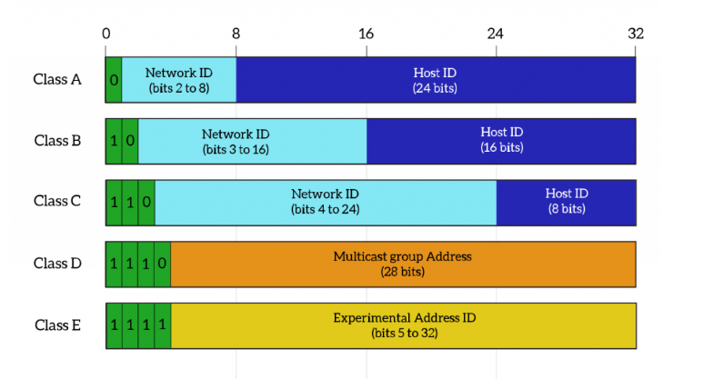

# IPv4 - Tài liệu đầy đủ cho CCNA

## Mục tiêu học tập

Tài liệu này tổng hợp kiến thức IPv4 theo hướng học CCNA. Nội dung đi từ khái niệm cơ bản đến cách tính subnet, các loại địa chỉ, cách host gửi gói tin, các giao thức liên quan và lệnh cấu hình/kiểm tra trên Cisco IOS.

Sau khi học xong, cần nắm được:

- IPv4 là gì và dùng để làm gì.
- Vì sao không có IPv1, IPv2, IPv3, IPv5 trong sử dụng phổ biến.
- Cấu trúc địa chỉ IPv4 32 bit.
- Các thành phần quan trọng của IPv4.
- Các lớp địa chỉ IPv4.
- Sự khác nhau giữa public IP và private IP.
- Cách chia địa chỉ IPv4 bằng subnetting, FLSM, VLSM.
- Phân biệt unicast, broadcast, multicast.
- Hiểu subnet, subnet mask, prefix/CIDR.
- Cấu hình và troubleshooting IPv4 cơ bản trên Cisco.

## Mục lục

1. IPv4 là gì?
2. Vì sao không có IPv1, IPv2, IPv3, IPv5?
3. Vai trò của IPv4 trong mạng
4. Cấu trúc địa chỉ IPv4
5. Biểu diễn IPv4 dạng thập phân và nhị phân
6. Các thành phần của IPv4
7. Subnet, subnet mask và prefix
8. Network address, host address và broadcast address
9. Các lớp địa chỉ IPv4
10. Public IP và private IP
11. Các dải địa chỉ IPv4 đặc biệt
12. Unicast, broadcast và multicast
13. Cách kiểm tra hai IP cùng mạng hay khác mạng
14. Cách chia địa chỉ IPv4
15. FLSM
16. VLSM
17. Route summarization
18. Default gateway
19. ARP trong IPv4
20. ICMP, ping và traceroute
21. DHCP trong IPv4
22. NAT và PAT
23. IPv4 header
24. TTL, MTU và fragmentation
25. Routing IPv4
26. Wildcard mask
27. Cấu hình IPv4 trên Cisco IOS
28. Lệnh kiểm tra và troubleshooting
29. Các lỗi IPv4 thường gặp
30. Bài tập luyện tập
31. Checklist ôn tập nhanh

## 1. IPv4 là gì?

IPv4, viết tắt của Internet Protocol version 4, là giao thức địa chỉ lớp mạng dùng để định danh thiết bị và định tuyến gói tin trong mạng IP. IPv4 hoạt động ở tầng 3 của mô hình OSI, tức tầng Network.

IPv4 giúp trả lời 2 câu hỏi quan trọng:

- Thiết bị nào đang gửi hoặc nhận dữ liệu?
- Gói tin cần đi qua router nào để đến mạng đích?

Ví dụ địa chỉ IPv4:

```text
192.168.1.10
8.8.8.8
10.0.0.1
```

Đặc điểm chính:

- IPv4 dài 32 bit.
- Viết dưới dạng 4 số thập phân, ngăn cách bằng dấu chấm.
- Mỗi phần gọi là một octet, có giá trị từ 0 đến 255.
- IPv4 là giao thức best-effort, không tự đảm bảo gói tin chắc chắn đến đích.
- Việc truyền tin tin cậy, nếu cần, thường do TCP ở tầng Transport đảm nhiệm.

## 2. Vì sao không có IPv1, IPv2, IPv3, IPv5?

Tên gọi "IPv4" dễ làm người học nghĩ rằng trước đó có IPv1, IPv2, IPv3 được dùng rộng rãi. Thực tế, các phiên bản trước IPv4 chủ yếu là bản thử nghiệm trong quá trình phát triển giao thức Internet.

Tóm tắt:

| Phiên bản | Tình trạng | Ghi chú |
|----------|------------|---------|
| IPv1 | Thử nghiệm | Không trở thành chuẩn dùng rộng rãi |
| IPv2 | Thử nghiệm | Không triển khai phổ biến |
| IPv3 | Thử nghiệm | Một phần quá trình phát triển ban đầu |
| IPv4 | Chuẩn phổ biến | Phiên bản Internet Protocol được triển khai rộng rãi nhất |
| IPv5 | Gắn với Internet Stream Protocol | Dùng cho thử nghiệm truyền luồng, không thay thế IPv4 |
| IPv6 | Chuẩn hiện đại | Được tạo để giải quyết giới hạn địa chỉ của IPv4 |

IPv5 không phải phiên bản kế tiếp của IPv4 trong Internet thông thường. Số version 5 từng được dùng cho một giao thức thử nghiệm tên là Internet Stream Protocol, nên khi thiết kế giao thức IP thế hệ mới, người ta chọn số 6, tạo thành IPv6.

## 3. Vai trò của IPv4 trong mạng

IPv4 có 2 vai trò lớn:

1. Định danh thiết bị trong mạng.
2. Hỗ trợ định tuyến gói tin giữa các mạng khác nhau.

Ví dụ:

```text
PC1: 192.168.1.10/24
PC2: 192.168.1.20/24
Router: 192.168.1.1/24
```

PC1 và PC2 cùng mạng `192.168.1.0/24`, nên có thể gửi dữ liệu trực tiếp trong LAN thông qua địa chỉ MAC.

Nếu PC1 muốn gửi đến `8.8.8.8`, địa chỉ này không thuộc mạng local. PC1 phải gửi gói tin đến default gateway, thường là router `192.168.1.1`.

## 4. Cấu trúc địa chỉ IPv4

IPv4 dài 32 bit, chia thành 4 octet. Mỗi octet có 8 bit.

```text
192.168.1.10
```

Biểu diễn nhị phân:

```text
192        .168        .1          .10
11000000   10101000    00000001    00001010
```

Một địa chỉ IPv4 gồm 2 phần:

- Network portion: phần mạng, xác định địa chỉ thuộc mạng nào.
- Host portion: phần host, xác định thiết bị cụ thể trong mạng đó.

Subnet mask hoặc prefix quyết định bao nhiêu bit thuộc phần network và bao nhiêu bit thuộc phần host.


Ví dụ:

```text
IP address:   192.168.1.10
Subnet mask:  255.255.255.0
Prefix:       /24
Network:      192.168.1.0
Host part:    10
```

## 5. Biểu diễn IPv4 dạng thập phân và nhị phân

Máy tính xử lý địa chỉ IPv4 ở dạng nhị phân, nhưng con người thường đọc ở dạng thập phân.

Giá trị bit trong một octet:

```text
128 64 32 16 8 4 2 1
```

Ví dụ đổi `192` sang nhị phân:

```text
192 = 128 + 64
192 = 11000000
```

Ví dụ đổi `10` sang nhị phân:

```text
10 = 8 + 2
10 = 00001010
```

Bảng một số giá trị thường gặp:

| Thập phân | Nhị phân |
|----------|----------|
| 0 | 00000000 |
| 1 | 00000001 |
| 2 | 00000010 |
| 4 | 00000100 |
| 8 | 00001000 |
| 16 | 00010000 |
| 32 | 00100000 |
| 64 | 01000000 |
| 128 | 10000000 |
| 192 | 11000000 |
| 224 | 11100000 |
| 240 | 11110000 |
| 248 | 11111000 |
| 252 | 11111100 |
| 254 | 11111110 |
| 255 | 11111111 |

## 6. Các thành phần của IPv4

Khi học IPv4, cần phân biệt các thành phần sau:

| Thành phần | Ý nghĩa |
|-----------|---------|
| IP address | Địa chỉ định danh thiết bị hoặc interface |
| Subnet mask | Xác định phần network và phần host |
| Prefix/CIDR | Cách viết ngắn của subnet mask, ví dụ `/24` |
| Network address | Địa chỉ đại diện cho cả mạng |
| Broadcast address | Địa chỉ gửi đến tất cả host trong subnet |
| Usable host range | Dải địa chỉ có thể gán cho thiết bị |
| Default gateway | Router mà host gửi traffic ra ngoài subnet |
| DNS server | Máy chủ phân giải tên miền sang IP |

Ví dụ cấu hình IPv4 trên một máy:

```text
IP address:       192.168.1.10
Subnet mask:      255.255.255.0
Default gateway:  192.168.1.1
DNS server:       8.8.8.8
```

## 7. Subnet, subnet mask và prefix

### 7.1. Subnet là gì?

Subnet là mạng con được chia ra từ một mạng lớn hơn. Chia subnet giúp:

- Quản lý địa chỉ IP tốt hơn.
- Giảm kích thước broadcast domain.
- Tách các phòng ban hoặc VLAN.
- Tăng tính bảo mật và dễ kiểm soát traffic.
- Tiết kiệm địa chỉ IPv4.

Ví dụ mạng `192.168.1.0/24` có thể chia thành 4 subnet `/26`:

```text
192.168.1.0/26
192.168.1.64/26
192.168.1.128/26
192.168.1.192/26
```

### 7.2. Subnet mask là gì?

Subnet mask là giá trị 32 bit dùng để xác định phần network và phần host của IPv4.

Bit `1` là phần network. Bit `0` là phần host.

Ví dụ:

```text
255.255.255.0
11111111.11111111.11111111.00000000
```

Mask trên có 24 bit `1`, nên tương đương `/24`.

### 7.3. Prefix/CIDR là gì?

Prefix là cách viết số lượng bit network bằng dấu `/`.

Ví dụ:

| Prefix | Subnet mask |
|--------|-------------|
| /8 | 255.0.0.0 |
| /16 | 255.255.0.0 |
| /24 | 255.255.255.0 |
| /25 | 255.255.255.128 |
| /26 | 255.255.255.192 |
| /27 | 255.255.255.224 |
| /28 | 255.255.255.240 |
| /29 | 255.255.255.248 |
| /30 | 255.255.255.252 |
| /31 | 255.255.255.254 |
| /32 | 255.255.255.255 |

CIDR, viết tắt của Classless Inter-Domain Routing, cho phép dùng prefix linh hoạt thay vì phụ thuộc cứng vào class A, B, C.

## 8. Network address, host address và broadcast address

### 8.1. Network address

Network address đại diện cho cả subnet. Tất cả bit host đều bằng `0`.

Ví dụ:

```text
IP:       192.168.1.10/24
Network:  192.168.1.0
```

Địa chỉ `192.168.1.0` không gán cho host trong subnet `/24` thông thường.

### 8.2. Broadcast address

Broadcast address dùng để gửi đến tất cả host trong subnet. Tất cả bit host đều bằng `1`.

Ví dụ:

```text
Network:    192.168.1.0/24
Broadcast:  192.168.1.255
```

Địa chỉ `192.168.1.255` không gán cho host trong subnet `/24` thông thường.

### 8.3. Host address

Host address là địa chỉ có thể gán cho thiết bị.

Ví dụ:

```text
Network:         192.168.1.0/24
Usable hosts:    192.168.1.1 - 192.168.1.254
Broadcast:       192.168.1.255
```

## 9. Các lớp địa chỉ IPv4

Trước khi CIDR phổ biến, IPv4 được chia thành các class. CCNA vẫn yêu cầu hiểu khái niệm này.

| Class | Dải địa chỉ | Default mask | Mục đích |
|-------|-------------|--------------|----------|
| A | 1.0.0.0 - 126.255.255.255 | 255.0.0.0 /8 | Mạng rất lớn |
| B | 128.0.0.0 - 191.255.255.255 | 255.255.0.0 /16 | Mạng vừa |
| C | 192.0.0.0 - 223.255.255.255 | 255.255.255.0 /24 | Mạng nhỏ |
| D | 224.0.0.0 - 239.255.255.255 | Không có | Multicast |
| E | 240.0.0.0 - 255.255.255.255 | Không có | Reserved/experimental |


Lưu ý:

- `127.0.0.0/8` dành cho loopback, ví dụ `127.0.0.1`.
- `0.0.0.0` thường biểu diễn địa chỉ chưa xác định hoặc default route.
- Class D không dùng để gán unicast cho host.
- Ngày nay subnetting chủ yếu dùng CIDR, không phụ thuộc class mặc định.

## 10. Public IP và private IP

### 10.1. Public IP

Public IP là địa chỉ có thể định tuyến trên Internet công cộng. Public IP phải duy nhất toàn cầu.

Ví dụ:

```text
8.8.8.8
1.1.1.1
```

Public IP thường được cấp bởi ISP hoặc tổ chức quản lý địa chỉ Internet.

### 10.2. Private IP

Private IP dùng trong mạng nội bộ, không được định tuyến trực tiếp trên Internet công cộng.

Dải private IPv4 theo RFC 1918:

| Dải private | CIDR |
|-------------|------|
| 10.0.0.0 - 10.255.255.255 | 10.0.0.0/8 |
| 172.16.0.0 - 172.31.255.255 | 172.16.0.0/12 |
| 192.168.0.0 - 192.168.255.255 | 192.168.0.0/16 |

Thiết bị dùng private IP muốn ra Internet thường phải đi qua NAT hoặc PAT.

Ví dụ:

```text
PC:      192.168.1.10
Phone:   192.168.1.11
Router:  192.168.1.1
```

Router dùng NAT/PAT để nhiều private IP có thể dùng chung một public IP.

## 11. Các dải địa chỉ IPv4 đặc biệt

| Địa chỉ/Dải địa chỉ | Ý nghĩa |
|---------------------|---------|
| 0.0.0.0 | Địa chỉ chưa xác định |
| 0.0.0.0/0 | Default route, đại diện cho mọi mạng |
| 127.0.0.0/8 | Loopback |
| 127.0.0.1 | Localhost |
| 169.254.0.0/16 | Link-local/APIPA, thường gặp khi không nhận được DHCP |
| 224.0.0.0/4 | Multicast |
| 255.255.255.255 | Limited broadcast |
| 192.0.2.0/24 | Documentation |
| 198.51.100.0/24 | Documentation |
| 203.0.113.0/24 | Documentation |
| 100.64.0.0/10 | Shared address space, hay dùng cho Carrier-Grade NAT |

## 12. Unicast, broadcast và multicast

### 12.1. Unicast

Unicast là truyền từ một nguồn đến một đích.

```text
192.168.1.10 -> 192.168.1.20
```

Đây là kiểu truyền phổ biến nhất trong IPv4.

### 12.2. Broadcast

Broadcast là truyền từ một nguồn đến tất cả host trong cùng broadcast domain.

Hai loại broadcast thường gặp:

- Limited broadcast: `255.255.255.255`.
- Directed broadcast: broadcast của một subnet, ví dụ `192.168.1.255` trong mạng `192.168.1.0/24`.

Router mặc định không forward broadcast giữa các mạng.

### 12.3. Multicast

Multicast là truyền từ một nguồn đến một nhóm thiết bị quan tâm. IPv4 multicast dùng dải `224.0.0.0/4`.

Ví dụ multicast hay gặp:

| Địa chỉ | Ý nghĩa |
|---------|---------|
| 224.0.0.1 | All hosts trong local subnet |
| 224.0.0.2 | All routers trong local subnet |
| 224.0.0.5 | OSPF all SPF routers |
| 224.0.0.6 | OSPF designated routers |
| 224.0.0.9 | RIP v2 |
| 224.0.0.10 | EIGRP |

## 13. Cách kiểm tra hai IP cùng mạng hay khác mạng

Hai IP cùng mạng nếu kết quả AND giữa IP và subnet mask giống nhau.

Ví dụ 1:

```text
Host A: 192.168.1.10/24
Host B: 192.168.1.20/24
```

Cả hai đều thuộc mạng:

```text
192.168.1.0/24
```

Kết luận: cùng mạng.

Ví dụ 2:

```text
Host A: 192.168.1.10/24
Host B: 192.168.2.20/24
```

Host A thuộc `192.168.1.0/24`, host B thuộc `192.168.2.0/24`.

Kết luận: khác mạng, cần router để giao tiếp.

## 14. Cách chia địa chỉ IPv4

Khi chia subnet, cần xác định:

- Mạng gốc.
- Số subnet cần chia.
- Số host cần cho mỗi subnet.
- Prefix mới.
- Block size.
- Network address, usable host range, broadcast address.

Công thức:

```text
Số địa chỉ trong subnet = 2^h
Số host dùng được       = 2^h - 2
Số subnet tạo được      = 2^n
```

Trong đó:

- `h` là số bit host.
- `n` là số bit mượn từ phần host.

Block size:

```text
Block size = 256 - giá trị subnet mask ở octet đang chia
```

Ví dụ `/26`:

```text
/26 = 255.255.255.192
Block size = 256 - 192 = 64
```

Các subnet của `192.168.1.0/24` khi chia `/26`:

| Subnet | Network | Usable hosts | Broadcast |
|--------|---------|--------------|-----------|
| 1 | 192.168.1.0/26 | 192.168.1.1 - 192.168.1.62 | 192.168.1.63 |
| 2 | 192.168.1.64/26 | 192.168.1.65 - 192.168.1.126 | 192.168.1.127 |
| 3 | 192.168.1.128/26 | 192.168.1.129 - 192.168.1.190 | 192.168.1.191 |
| 4 | 192.168.1.192/26 | 192.168.1.193 - 192.168.1.254 | 192.168.1.255 |

Ví dụ tính subnet:

```text
IP:      172.16.35.123/20
Mask:    255.255.240.0
Block:   256 - 240 = 16
Octet 3: 35 nằm trong khoảng 32 - 47

Network:    172.16.32.0
Broadcast:  172.16.47.255
Hosts:      172.16.32.1 - 172.16.47.254
```

## 15. FLSM

FLSM, viết tắt của Fixed Length Subnet Mask, là cách chia một mạng thành nhiều subnet có cùng kích thước và cùng subnet mask.

Ví dụ: Chia `192.168.10.0/24` thành 4 subnet bằng nhau.

```text
Cần 4 subnet -> 2^2 = 4 -> mượn 2 bit
/24 + 2 = /26
```

Kết quả:

| Subnet | Network | Usable hosts | Broadcast |
|--------|---------|--------------|-----------|
| 1 | 192.168.10.0/26 | 192.168.10.1 - 192.168.10.62 | 192.168.10.63 |
| 2 | 192.168.10.64/26 | 192.168.10.65 - 192.168.10.126 | 192.168.10.127 |
| 3 | 192.168.10.128/26 | 192.168.10.129 - 192.168.10.190 | 192.168.10.191 |
| 4 | 192.168.10.192/26 | 192.168.10.193 - 192.168.10.254 | 192.168.10.255 |

FLSM dễ tính nhưng có thể lãng phí IP nếu mỗi subnet cần số host khác nhau.

## 16. VLSM

VLSM, viết tắt của Variable Length Subnet Mask, là kỹ thuật chia mạng thành các subnet có kích thước khác nhau.

Nguyên tắc:

1. Sắp xếp nhu cầu host từ lớn đến nhỏ.
2. Cấp subnet lớn nhất trước.
3. Chọn prefix nhỏ nhất nhưng đủ host.
4. Subnet sau bắt đầu ngay sau subnet trước.

Ví dụ: Có mạng `192.168.20.0/24`, cần:

- LAN A: 100 host.
- LAN B: 50 host.
- LAN C: 25 host.
- WAN: 2 host.

Chọn prefix:

| Nhu cầu | Prefix | Host dùng được |
|---------|--------|----------------|
| 100 | /25 | 126 |
| 50 | /26 | 62 |
| 25 | /27 | 30 |
| 2 | /30 | 2 |

Phân bổ:

| Mạng | Subnet | Usable hosts | Broadcast |
|------|--------|--------------|-----------|
| A | 192.168.20.0/25 | 192.168.20.1 - 192.168.20.126 | 192.168.20.127 |
| B | 192.168.20.128/26 | 192.168.20.129 - 192.168.20.190 | 192.168.20.191 |
| C | 192.168.20.192/27 | 192.168.20.193 - 192.168.20.222 | 192.168.20.223 |
| WAN | 192.168.20.224/30 | 192.168.20.225 - 192.168.20.226 | 192.168.20.227 |

## 17. Route summarization

Route summarization là kỹ thuật gộp nhiều route nhỏ thành một route lớn hơn để routing table gọn hơn.

Ví dụ:

```text
192.168.0.0/24
192.168.1.0/24
192.168.2.0/24
192.168.3.0/24
```

Có thể gộp thành:

```text
192.168.0.0/22
```

Vì `/22` bao phủ:

```text
192.168.0.0 - 192.168.3.255
```

Không nên summary quá rộng nếu route summary bao gồm cả những mạng không thật sự nằm phía sau router đó.

## 18. Default gateway

Default gateway là địa chỉ router mà host dùng để gửi traffic ra ngoài subnet.

Ví dụ:

```text
Host IP:          192.168.1.10
Subnet mask:      255.255.255.0
Default gateway:  192.168.1.1
```

Nếu host gửi đến `192.168.1.20`, đích cùng mạng nên gửi trực tiếp.

Nếu host gửi đến `8.8.8.8`, đích khác mạng nên gửi đến default gateway `192.168.1.1`.

Nếu sai default gateway:

- Host vẫn có thể liên lạc với thiết bị cùng subnet.
- Host không đi được sang mạng khác hoặc Internet.

## 19. ARP trong IPv4

ARP, viết tắt của Address Resolution Protocol, dùng để ánh xạ địa chỉ IPv4 sang địa chỉ MAC trong cùng LAN.

Ví dụ PC `192.168.1.10` muốn gửi đến `192.168.1.20`:

1. PC kiểm tra ARP cache.
2. Nếu chưa có MAC của `192.168.1.20`, PC gửi ARP Request dạng broadcast.
3. Host `192.168.1.20` trả lời ARP Reply kèm MAC.
4. PC gửi frame Ethernet đến MAC đó.

Nếu đích khác subnet, PC không ARP cho IP đích cuối cùng. PC ARP để tìm MAC của default gateway.

Lệnh kiểm tra:

```powershell
arp -a
```

Trên Cisco:

```text
show arp
show ip arp
```

## 20. ICMP, ping và traceroute

ICMP, viết tắt của Internet Control Message Protocol, dùng để gửi thông báo lỗi và thông tin chẩn đoán trong mạng IP.

Công cụ phổ biến:

- `ping`: kiểm tra thiết bị có reachable không.
- `tracert` trên Windows hoặc `traceroute` trên Cisco/Linux: kiểm tra đường đi qua các router.

Ví dụ Windows:

```powershell
ping 8.8.8.8
tracert 8.8.8.8
```

Một số ICMP message:

| Message | Ý nghĩa |
|---------|---------|
| Echo Request | Gói yêu cầu của ping |
| Echo Reply | Gói phản hồi của ping |
| Destination Unreachable | Không đến được đích |
| Time Exceeded | TTL hết hạn |

## 21. DHCP trong IPv4

DHCP tự động cấp thông tin IPv4 cho client.

Thông tin DHCP thường cấp:

- IP address.
- Subnet mask.
- Default gateway.
- DNS server.
- Lease time.

Quy trình DORA:

1. Discover.
2. Offer.
3. Request.
4. Acknowledge.

Port:

```text
DHCP server: UDP 67
DHCP client: UDP 68
```

Cấu hình DHCP server trên Cisco:

```text
conf t
ip dhcp excluded-address 192.168.1.1 192.168.1.20
ip dhcp pool LAN1
 network 192.168.1.0 255.255.255.0
 default-router 192.168.1.1
 dns-server 8.8.8.8 1.1.1.1
end
```

Kiểm tra:

```text
show ip dhcp binding
show ip dhcp pool
```

DHCP relay khi DHCP server nằm khác mạng:

```text
interface vlan 10
 ip address 192.168.10.1 255.255.255.0
 ip helper-address 192.168.100.10
```

## 22. NAT và PAT

NAT, viết tắt của Network Address Translation, chuyển đổi địa chỉ IP khi gói tin đi qua router/firewall.

PAT, viết tắt của Port Address Translation, cho phép nhiều private IP dùng chung một public IP bằng cách phân biệt port.

Thuật ngữ NAT:

| Thuật ngữ | Ý nghĩa |
|----------|---------|
| Inside local | Địa chỉ private của host bên trong |
| Inside global | Địa chỉ public đại diện cho host bên trong |
| Outside local | Địa chỉ host bên ngoài nhìn từ trong |
| Outside global | Địa chỉ thật của host bên ngoài |

Cấu hình PAT mẫu:

```text
access-list 1 permit 192.168.1.0 0.0.0.255

interface g0/0
 ip address 192.168.1.1 255.255.255.0
 ip nat inside
 no shutdown

interface g0/1
 ip address 203.0.113.2 255.255.255.252
 ip nat outside
 no shutdown

ip route 0.0.0.0 0.0.0.0 203.0.113.1
ip nat inside source list 1 interface g0/1 overload
```

Kiểm tra:

```text
show ip nat translations
show ip nat statistics
```

## 23. IPv4 header

IPv4 header chứa thông tin cần thiết để xử lý và định tuyến gói tin.

Các trường quan trọng:

| Trường | Ý nghĩa |
|--------|---------|
| Version | Phiên bản IP, IPv4 có giá trị 4 |
| IHL | Độ dài header |
| DSCP/ECN | QoS và thông báo tắc nghẽn |
| Total Length | Tổng chiều dài gói IP |
| Identification | Dùng khi phân mảnh |
| Flags | Điều khiển phân mảnh |
| Fragment Offset | Vị trí mảnh trong gói ban đầu |
| TTL | Giới hạn số hop |
| Protocol | Giao thức tầng trên |
| Header Checksum | Kiểm tra lỗi header |
| Source IP | Địa chỉ nguồn |
| Destination IP | Địa chỉ đích |

Độ dài IPv4 header:

- Tối thiểu 20 byte.
- Tối đa 60 byte nếu có options.

Protocol number thường gặp:

| Số | Giao thức |
|----|-----------|
| 1 | ICMP |
| 6 | TCP |
| 17 | UDP |
| 89 | OSPF |

## 24. TTL, MTU và fragmentation

### 24.1. TTL

TTL, viết tắt của Time To Live, giúp tránh gói tin lặp vô hạn.

Mỗi router khi forward gói sẽ giảm TTL đi 1. Nếu TTL về 0, router hủy gói và thường gửi ICMP Time Exceeded.

### 24.2. MTU

MTU, viết tắt của Maximum Transmission Unit, là kích thước tối đa của gói có thể truyền qua một liên kết. Ethernet thường dùng MTU 1500 byte.

### 24.3. Fragmentation

Nếu gói IPv4 lớn hơn MTU, gói có thể bị phân mảnh nếu bit DF không được bật.

Điểm cần nhớ:

- IPv4 hỗ trợ fragmentation.
- Fragmentation làm tăng overhead.
- Nếu DF bật và gói quá lớn, router hủy gói và gửi ICMP báo lỗi.
- Path MTU Discovery dùng DF và ICMP để tìm MTU phù hợp.

## 25. Routing IPv4

Router chuyển gói dựa trên routing table.

Một route thường gồm:

- Network/prefix đích.
- Next-hop hoặc exit interface.
- Administrative distance.
- Metric.
- Nguồn học route.

Nguyên tắc quan trọng nhất: longest prefix match.

Ví dụ:

```text
10.0.0.0/8       via R1
10.10.0.0/16     via R2
10.10.10.0/24    via R3
```

Gói đến `10.10.10.5` sẽ chọn route `10.10.10.0/24` vì cụ thể nhất.

Static route:

```text
ip route 192.168.2.0 255.255.255.0 10.0.12.2
```

Default route:

```text
ip route 0.0.0.0 0.0.0.0 192.168.1.1
```

## 26. Wildcard mask

Wildcard mask thường dùng trong ACL và OSPF trên Cisco.

Wildcard là dạng đảo bit của subnet mask:

```text
Wildcard = 255.255.255.255 - Subnet mask
```

Ví dụ:

| Subnet mask | Wildcard mask |
|------------|---------------|
| 255.255.255.0 | 0.0.0.255 |
| 255.255.255.128 | 0.0.0.127 |
| 255.255.255.252 | 0.0.0.3 |
| 255.255.0.0 | 0.0.255.255 |

ACL ví dụ:

```text
access-list 10 permit 192.168.1.0 0.0.0.255
```

OSPF ví dụ:

```text
router ospf 1
 network 192.168.1.0 0.0.0.255 area 0
```

## 27. Cấu hình IPv4 trên Cisco IOS

### 27.1. Cấu hình IP trên interface router

```text
enable
configure terminal
interface gigabitEthernet0/0
 description LAN
 ip address 192.168.1.1 255.255.255.0
 no shutdown
end
```

Kiểm tra:

```text
show ip interface brief
show running-config interface gigabitEthernet0/0
show interfaces gigabitEthernet0/0
```

### 27.2. Cấu hình default gateway trên switch Layer 2

```text
enable
configure terminal
interface vlan 1
 ip address 192.168.1.2 255.255.255.0
 no shutdown
exit
ip default-gateway 192.168.1.1
end
```

### 27.3. Static route hai chiều

Mô hình:

```text
LAN1 192.168.1.0/24 -- R1 -- 10.0.12.0/30 -- R2 -- LAN2 192.168.2.0/24
```

Trên R1:

```text
ip route 192.168.2.0 255.255.255.0 10.0.12.2
```

Trên R2:

```text
ip route 192.168.1.0 255.255.255.0 10.0.12.1
```

## 28. Lệnh kiểm tra và troubleshooting

### 28.1. Trên Windows

```powershell
ipconfig
ipconfig /all
ping 192.168.1.1
tracert 8.8.8.8
arp -a
route print
nslookup google.com
```

### 28.2. Trên Cisco IOS

```text
show ip interface brief
show ip route
show arp
show ip arp
show running-config
show interfaces
ping
traceroute
```

### 28.3. Quy trình xử lý lỗi IPv4

1. Kiểm tra IP, subnet mask, default gateway.
2. Ping chính IP của host.
3. Ping `127.0.0.1` để kiểm tra TCP/IP stack.
4. Ping default gateway.
5. Ping IP ngoài mạng.
6. Nếu ping IP được nhưng ping tên miền không được, kiểm tra DNS.
7. Trên router, kiểm tra interface `up/up`.
8. Kiểm tra routing table.
9. Kiểm tra ACL, NAT, firewall nếu route đúng nhưng traffic vẫn lỗi.

## 29. Các lỗi IPv4 thường gặp

| Lỗi | Biểu hiện | Cách kiểm tra |
|-----|-----------|---------------|
| Sai subnet mask | Host tưởng cùng mạng là khác mạng hoặc ngược lại | `ipconfig /all`, tính network |
| Sai default gateway | Đi LAN được nhưng không ra mạng khác | Ping gateway |
| Trùng IP | Kết nối chập chờn | ARP table, log hệ thống |
| Không nhận DHCP | IP thành `169.254.x.x` | Kiểm tra DHCP server, VLAN, relay |
| Thiếu route chiều về | Ping không có reply | Kiểm tra routing table hai đầu |
| Sai NAT | LAN không ra Internet | `show ip nat translations` |
| ACL chặn | Route đúng nhưng traffic bị drop | Kiểm tra ACL trên interface |
| Interface down | Không giao tiếp được | `show ip interface brief` |

## 30. Bài tập luyện tập

### Bài 1

Cho IP `192.168.5.77/26`. Tìm subnet mask, network, broadcast và dải host.

Đáp án:

```text
/26 = 255.255.255.192
Block size = 64
77 nằm trong khoảng 64 - 127

Network:    192.168.5.64
Broadcast:  192.168.5.127
Hosts:      192.168.5.65 - 192.168.5.126
```

### Bài 2

Cho IP `10.10.18.200/21`. Tìm network và broadcast.

Đáp án:

```text
/21 = 255.255.248.0
Block size = 8 ở octet 3
18 nằm trong khoảng 16 - 23

Network:    10.10.16.0
Broadcast:  10.10.23.255
Hosts:      10.10.16.1 - 10.10.23.254
```

### Bài 3

Chia `192.168.30.0/24` thành các subnet cần ít nhất 30 host.

Đáp án:

```text
2^h - 2 >= 30
h = 5
Prefix = 32 - 5 = /27
Mask = 255.255.255.224
Block size = 32
```

Các subnet:

```text
192.168.30.0/27
192.168.30.32/27
192.168.30.64/27
192.168.30.96/27
192.168.30.128/27
192.168.30.160/27
192.168.30.192/27
192.168.30.224/27
```

### Bài 4

Hai host sau có cùng mạng không?

```text
Host A: 172.16.10.20/22
Host B: 172.16.15.200/22
```

Đáp án:

```text
/22 = 255.255.252.0
Block size octet 3 = 4

10 nằm trong khoảng 8 - 11
15 nằm trong khoảng 12 - 15

Host A network: 172.16.8.0/22
Host B network: 172.16.12.0/22

Kết luận: khác mạng.
```

## 31. Checklist ôn tập nhanh

- IPv4 dài 32 bit.
- IPv4 gồm 4 octet, mỗi octet 8 bit.
- Mỗi octet có giá trị từ 0 đến 255.
- Subnet mask xác định phần network và host.
- Prefix `/24` nghĩa là 24 bit network.
- Network address có toàn bộ bit host bằng 0.
- Broadcast address có toàn bộ bit host bằng 1.
- Host dùng được thông thường bằng `2^h - 2`.
- Private IP gồm `10.0.0.0/8`, `172.16.0.0/12`, `192.168.0.0/16`.
- Public IP có thể định tuyến trên Internet.
- Host gửi traffic khác mạng đến default gateway.
- ARP đổi IPv4 sang MAC trong cùng LAN.
- DHCP cấp IP tự động theo DORA.
- NAT/PAT giúp private IP truy cập Internet.
- Router chọn route theo longest prefix match.
- Wildcard mask là subnet mask đảo bit.
- `127.0.0.1` là localhost.
- `169.254.0.0/16` thường xuất hiện khi không nhận được DHCP.
- Broadcast gửi đến tất cả host trong subnet.
- Multicast gửi đến một nhóm host quan tâm.

## Sơ đồ tư duy ngắn

```text
IPv4
|
+-- Địa chỉ
|   +-- 32 bit
|   +-- 4 octet
|   +-- network + host
|
+-- Subnetting
|   +-- subnet
|   +-- subnet mask
|   +-- prefix/CIDR
|   +-- FLSM
|   +-- VLSM
|
+-- Loại truyền
|   +-- unicast
|   +-- broadcast
|   +-- multicast
|
+-- Dịch vụ liên quan
|   +-- ARP
|   +-- ICMP
|   +-- DHCP
|   +-- NAT/PAT
|
+-- Routing
    +-- connected route
    +-- static route
    +-- dynamic route
    +-- longest prefix match
```

## Ghi nhớ cuối cùng

IPv4 không chỉ là một địa chỉ gán cho máy tính. Khi học CCNA, cần hiểu IPv4 như một hệ thống gồm địa chỉ, subnet mask, prefix, ARP, gateway, routing, DHCP, NAT, ICMP và cách router xử lý gói tin. Nếu nắm chắc subnetting và luồng xử lý "cùng mạng hay khác mạng", phần lớn bài lab IPv4 sẽ dễ hơn rất nhiều.
